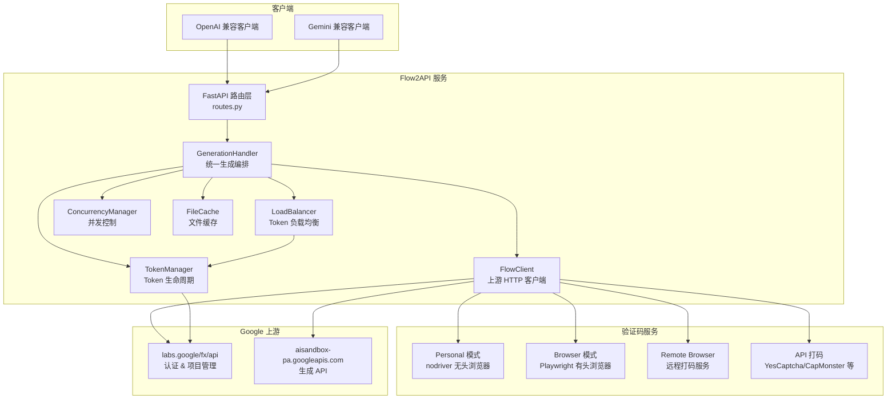
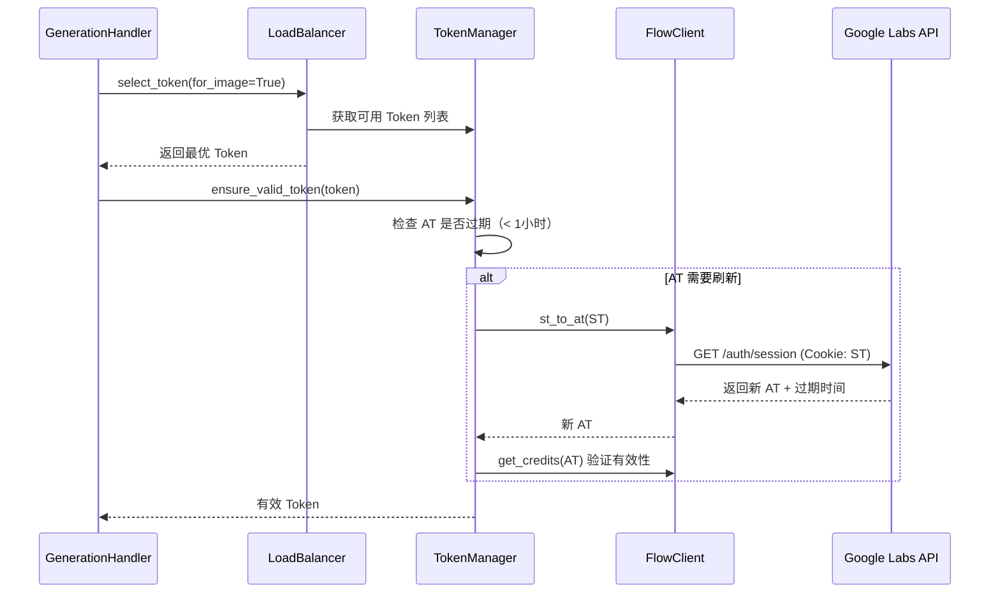
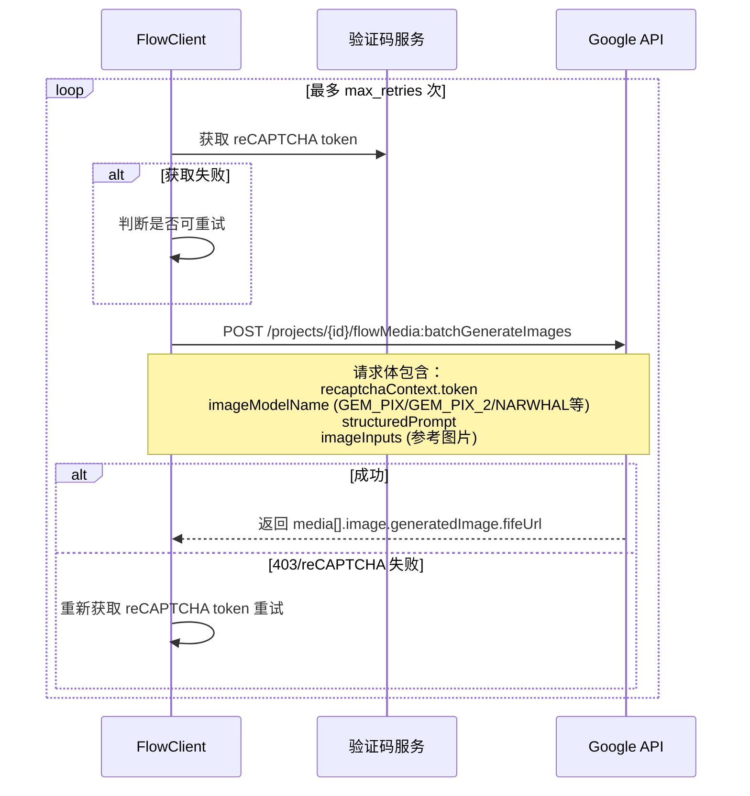

# Flow2API 架构分析：代理 Flow 生图请求与验证机制

## 项目定位

Flow2API 是一个将 Google Labs Flow/VideoFX 的图片和视频生成能力，包装为 **OpenAI 兼容 API** 和 **Gemini 兼容 API** 的反向代理服务。用户通过标准 API 调用即可使用 Flow 的生成能力，无需直接操作 Flow 网页界面。

---

## 整体架构



---

## 核心请求流程（以图片生成为例）

### 第 1 步：API 请求接收与归一化

> 入口文件：[routes.py](file:///g:/Users/Administrator/Documents/AI/Codex/Oh-My-Flow2/src/api/routes.py)

- **OpenAI 格式** (`POST /v1/chat/completions`)：从 `messages` 中提取 prompt 和图片
- **Gemini 格式** (`POST /v1beta/models/{model}:generateContent`)：从 `contents` 中提取

两种格式统一归一化为内部 `NormalizedGenerationRequest(model, prompt, images)`。

### 第 2 步：Token 选择与认证

> 核心文件：[token_manager.py](file:///g:/Users/Administrator/Documents/AI/Codex/Oh-My-Flow2/src/services/token_manager.py)



**认证体系采用双 Token 机制：**

| Token | 全称 | 用途 | 存储方式 |
|-------|------|------|----------|
| **ST** | Session Token | 长期凭证，用于换取 AT | `__Secure-next-auth.session-token` Cookie |
| **AT** | Access Token | 短期凭证，用于调用 API | `Authorization: Bearer` 请求头 |

- ST → AT 转换：通过 `GET /auth/session` 接口，带上 ST Cookie
- AT 有效期约 1 小时，不足 1 小时时自动刷新
- AT 验证：刷新后通过 `GET /v1/credits` 接口确认有效性

### 第 3 步：项目管理

每个 Token 维护一个**项目池**（默认 4 个项目），采用 **Round-Robin** 轮询策略：

- 每次请求选择不同的 `project_id`，分散请求以降低限流风险
- 项目通过 `POST /trpc/project.createProject` 创建
- 项目池大小可配置（`personal_project_pool_size`）

### 第 4 步：reCAPTCHA 验证（核心难点）

> 核心文件：[flow_client.py L2296-2498](file:///g:/Users/Administrator/Documents/AI/Codex/Oh-My-Flow2/src/services/flow_client.py#L2296-L2498)

> [!IMPORTANT]
> **Flow 的每一次生成请求都需要携带有效的 reCAPTCHA v3 Enterprise token。** 这是整个代理方案中最关键的技术难点。

reCAPTCHA 站点密钥（固定）：`6LdsFiUsAAAAAIjVDZcuLhaHiDn5nnHVXVRQGeMV`

项目支持 **4 种验证码解决方案**：

#### 方案 1：Personal 模式（nodriver 无头浏览器）

> 文件：[browser_captcha_personal.py](file:///g:/Users/Administrator/Documents/AI/Codex/Oh-My-Flow2/src/services/browser_captcha_personal.py)（172KB，4119行，最复杂的模块）

- 使用 `nodriver`（undetected-chromedriver 的继任者）启动反检测浏览器
- 维护**常驻标签页池**（最多 5 个），预先打开 Flow 页面
- 每次请求时在常驻标签页中执行 `grecaptcha.enterprise.execute()` 获取 token
- 支持浏览器指纹采集（UA、语言、sec-ch-ua 等），后续请求复用相同指纹
- 支持代理配置（含认证代理的 Chrome 扩展注入）

#### 方案 2：Browser 模式（Playwright 有头浏览器）

> 文件：[browser_captcha.py](file:///g:/Users/Administrator/Documents/AI/Codex/Oh-My-Flow2/src/services/browser_captcha.py)（102KB）

- 使用 Playwright 操作有头 Chromium
- 适用于需要 GUI 显示的 Docker Headed 环境
- 支持 Token 级别独立打码代理

#### 方案 3：Remote Browser（远程打码服务）

- 对接远程部署的浏览器打码服务
- 通过 `POST /api/v1/solve` 获取 token
- 支持预填充池（prefill）以降低延迟

#### 方案 4：API 打码服务

> 文件：[flow_client.py L2408-2498](file:///g:/Users/Administrator/Documents/AI/Codex/Oh-My-Flow2/src/services/flow_client.py#L2408-L2498)

支持 4 种商业打码平台：

| 平台 | Task Type |
|------|-----------|
| YesCaptcha | `RecaptchaV3TaskProxylessM1` |
| CapMonster | `RecaptchaV3TaskProxyless` |
| EZCaptcha | `ReCaptchaV3TaskProxylessS9` |
| CapSolver | `ReCaptchaV3EnterpriseTaskProxyLess` |

工作流程：`createTask` → 轮询 `getTaskResult`（最多 40 次，间隔 3 秒）→ 获取 `gRecaptchaResponse`

### 第 5 步：提交生成请求

> 文件：[flow_client.py L919-1082](file:///g:/Users/Administrator/Documents/AI/Codex/Oh-My-Flow2/src/services/flow_client.py#L919-L1082)



**请求结构关键字段：**

```json
{
  "clientContext": {
    "recaptchaContext": {
      "token": "reCAPTCHA_TOKEN",
      "applicationType": "RECAPTCHA_APPLICATION_TYPE_WEB"
    },
    "sessionId": "UUID",
    "projectId": "PROJECT_ID",
    "tool": "PINHOLE"
  },
  "useNewMedia": true,
  "requests": [{
    "imageModelName": "GEM_PIX_2",
    "imageAspectRatio": "IMAGE_ASPECT_RATIO_LANDSCAPE",
    "structuredPrompt": { "parts": [{ "text": "prompt" }] },
    "imageInputs": []
  }]
}
```

### 第 6 步：结果处理与缓存

生成成功后：
1. 从响应中提取 `fifeUrl`（Google CDN 图片链接）
2. 如需放大（2K/4K），调用 `upsampleImage` API（也需要 reCAPTCHA）
3. 下载图片到本地 `tmp/` 目录缓存
4. 返回本地缓存 URL 或 base64 内联数据

---

## 反检测与稳定性策略

### 请求伪装

| 策略 | 实现位置 |
|------|----------|
| **动态 User-Agent** | 按账号 ID 哈希固定生成，支持 Chrome/Firefox/Safari/Edge 多浏览器 |
| **浏览器指纹一致性** | 打码时采集指纹 → 生成请求时复用相同 UA、语言、sec-ch-ua |
| **默认客户端头** | 固定发送 `x-browser-channel`、`x-browser-validation`、`x-client-data` 等 Chrome 特征头 |
| **curl_cffi 模拟** | 使用 `impersonate="chrome110"` 模拟 Chrome TLS 指纹 |

### 容错与重试

| 机制 | 说明 |
|------|------|
| **reCAPTCHA 重试** | 验证码获取失败或 403 时自动重新获取并重试（最多 `max_retries` 次） |
| **网络超时快速重试** | 图片生成请求支持"主链路 + 备用媒体代理链路"双链路切换 |
| **HTTP 回退** | curl_cffi 请求失败时自动回退到 `urllib` |
| **429 限流保护** | 触发 429 时自动禁用 Token，12 小时后自动解禁 |
| **连续错误熔断** | 连续错误达阈值自动禁用 Token |
| **ST 自动续期** | AT 刷新失败时，Personal 模式通过常驻浏览器标签页自动获取新 ST |

---

## 支持的模型

| 类别 | 模型标识 | 上游名称 |
|------|----------|----------|
| **图片** | gemini-2.5-flash-image-* | GEM_PIX |
| **图片** | gemini-3.0-pro-image-* | GEM_PIX_2（支持 2K/4K） |
| **图片** | imagen-4.0-generate-preview-* | IMAGEN_3_5 |
| **图片** | gemini-3.1-flash-image-* | NARWHAL（支持 2K/4K） |
| **视频 T2V** | veo_3_1_t2v_fast_* | Veo 3.1 文生视频 |
| **视频 I2V** | veo_3_1_i2v_* | Veo 3.1 图生视频（首尾帧） |
| **视频 R2V** | veo_3_1_r2v_* | Veo 3.1 多图参考视频 |

---

## 总结

Flow2API 的核心技术价值在于：

1. **双格式 API 兼容**：同时暴露 OpenAI 和 Gemini 接口格式
2. **自动化 reCAPTCHA 绕过**：4 种打码方案覆盖不同部署场景
3. **Token 池化管理**：多账号负载均衡 + 项目轮询 + 自动续期
4. **请求指纹一致性**：打码浏览器指纹透传到生成请求，降低风控触发
5. **多层容错**：重试、链路切换、HTTP 回退、限流保护等全方位兜底
